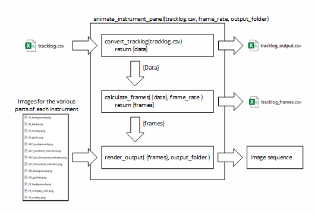

# Flight Instrument Simulator

A set of tools that can create motion graphics of some flight instruments using actual flight data logged by ForeFlight, a popular "electronic flight bag" (EFD) used by many pilots.

## Introduction

This project allows the user to create animations of the primary “steam gauge” instruments commonly used in older General Aviation aircraft using actual flight data. The script produces animations of the flight instruments according to the flight data. Flight track data can be exported in csv format from Foreflight's web interface as described later in this document.

Currently simulated instruments are:

1. Airspeed Indicator [1]
2. Attitude Indicator
3. Altimeter
4. Heading Indicator

[1]: The tracklog records ground speed instead of airspeed, so this indicator is actually showing ground speed. Ground speed can vary quite a bit from airspeed due to winds aloft.

This project contains two separate methods of creating the flight instrument graphics - one using purely python and another using Blender combined with its built-in python scripting feature. The python workflow is considerably easier to work with for those not familiar with blender.

## Python Workflow

The first (and simpler) method uses python to manipulate the flight instrument images and create a video file or image sequence. All processing is done within python. Output image quality is currently not very good, but rendering is reasonably fast compared to the second method. Virtually no optimization was performed on this method - there are probably ways to increase rendering speed further or to increase image quality.

>**NOTE** *One disadvantage of this method when it comes to quality is the use of pre-rasterized images as input. The python workflow relies on pre-generated png files to build up the final image of each instrument. Currently, the algorithm relies on rasterized graphics. An algorithm utilizing vector graphics would produce higher quality results.*

[openh264]: https://github.com/cisco/openh264
[LICENSE]: ./LICENSE

### Python Setup

1. Set up a python virtual environment.
2. Install packages to that virtual environment using `pip install -r requirements.txt`.

<!--- Not including video writer function at this time as it is a little more complicated to set up, but here is the info if it is decided to add it later.

3. Download the OpenH264 codec from [https://github.com/cisco/openh264][openh264] and extract the openh264-x.x.x-win64.dll file to the python_workflow folder. Before using this codec file you must read and agree to the license terms provided by Cisco. See the "About The Cisco-Provided Binary of OpenH264 Video Codec" section in [LICENSE].-->

### Running the Script

The script starts from `main.py`. Track log data should be located in the same folder as this python file and be named `tracklog.csv`. An example tracklog is included.

This is an example of the output:

You can then import this image sequence into your favoriate video editing tool.

## Blender Workflow

The second method uses blender and its python scripting feature. Flight instrument images are already set up in the blender model environment and the embedded python script is used to read the tracklog data file and set keyframes for the relevant images. Blender is then used to render the output animation to an image sequence or video file directly. This method produces a much higher quality result with broad capabilities to adjust lighting, colors, perspectives, etc at the cost of much longer rendering times.

### Running the python script in Blender

This section is still a work-in-progress.

Blender 4.3 was used to create the project file.

The `.blend` file contains all the instrument graphics. 

Basically, open the `.blend` file in Blender, click on the "Scripting" tab, and click the arrow next to the `main.py` to run. It may take a while for the script to process all the keyframes.
You can use your own tracklog downloaded from ForeFlight. The tracklogto be processed must be located in the same folder as the `.blend` file and be named `tracklog.csv`. An example tracklog is included.

]

Once all the keyframes are configured, just render the output as you see fit. Use of Blender is beyond the scope of this project...there are plenty of Youtube tutorials that will help you render the output.

This is what the output from Blender currently looks like:

At this time, the basic graphics will animate, but additional work is needed to improve the look.

## Why bother with this anyway?

Well, good question! By itself, this seems like it’s just an exercise for no practical reason.

The original reason for creating this project was so that I could display simulated flight instruments in my own videos of flights I record while flying in small GA aircraft as a private pilot. The equipment I use is already recording the flight data so I thought it would be interesting to do something creative with it. I’m also an engineer who likes to tinker with things and once I learned that this flight data was being recorded I wanted to see what I could do with it.

## Downloading Foreflight Tracklog Data

The scripts within this github project were developed using flight data captured by ForeFlight connected to a Sentry module. For this configuration, the flight data log contains records of aircraft groundspeed, course, altitude, bank, and pitch (among other parameters) at approximately 1 second intervals. An image of the flight instruments is created from this information for each data record.

