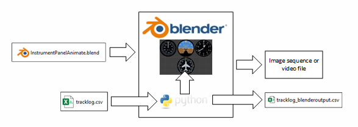

# Flight Instrument Simulator

A set of tools that can create motion graphics of some of the primary flight instruments using actual flight data logged by ForeFlight, a popular "electronic flight bag" (EFD) used by many pilots.

## Introduction

This script creates an image sequence of four of the primary “steam gauge” instruments commonly used in older General Aviation aircraft using actual flight data based on actual flight data recorded by Foreflight.  Flight track data can be exported in csv format from Foreflight's web interface as described later in this document.

Currently simulated instruments are:

1. Airspeed Indicator [1]
2. Attitude Indicator [2]
3. Altimeter
4. Heading Indicator

[1]: The tracklog records ground speed instead of airspeed, so this indicator is actually showing ground speed. Ground speed can vary quite a bit from airspeed due to winds aloft.

[2]: The code for generating the altimeter image sequence is fully implemented, however due to the way the Sentry module records Pitch and Bank, this data is proving difficult to create accurate animations from. As configured, the attitude indicator graphic is disabled when the image sequence is generated. See details in the "render_frames" section below

This project contains two separate methods of creating the flight instrument graphics - one using purely python and another using Blender combined with its built-in python scripting feature. The python workflow is considerably easier to work with for those not familiar with blender.

### Downloading Foreflight Tracklog Data

It is assumed you are already a ForeFlight user and have the necessary equipment to record track logs for your flights and store them in your logbook entries. These instructions give a high-level overview of downloading your already-saved track log data from your ForeFlight account. Using ForeFlight to record this data is beyond the scope of this README file.

The scripts within this github project were developed using flight data captured by ForeFlight connected to a Sentry module. 

For this configuration, the flight data log contains records of aircraft groundspeed, course, altitude, bank, and pitch (among other parameters) at approximately 1 second intervals. An image of the flight instruments is created from this information for each data record.

To download the data from your logbook, you'll need to log into ForeFlight web, access the Track Logs tab, click on the track log which you want to export, then click Details → Download, then select CSV format. The image below should prove useful.

## Python Workflow

The first method generates an image sequence of the instruments from the tracklog data all from within Python. The script takes advantage of Python multiprocessing leading to fast render times. A processing speed of nearly 200 frames per second or more can be achieved with modern hardware. 

>**NOTE** *One disadvantage of this method is that raster images are used as the input, resulting in lower quality output than if vector images were used. This limitation is due to the pillow library used to transform the images and save the image sequence. A library that supports vector graphics transformation may produce higher quality output.*

### Python Setup

1. Install python (the script was developed on various python installations from 3.9 through 3.13)
2. Set up a python virtual environment in the `python_workflow` folder.
3. Install `numpy` and `pillow` (or `pip install -r requirements.txt` using `requirements.txt` in the `python_workflow` folder)

Code development was primarily done in Visual Studio Code. If using Visual Studio Code, you'll want to open the`python_workflow` for debugging.

### Running the Script

The script starts from `animate_instrument_panel`. Run the `animate_instrument_panel.py` file directly or call the method from your own program.

Track log data should be located in the same folder as this python file and be named `tracklog.csv`. You can change the filename in the script to match the filename of whatever csv file you are trying to process. An example tracklog is included as a reference for the expected data format.

This is an example of the output when overlayed on footage from a wing-mounted camera:

### Inner Workings of the Script

The script is organized into three primary methods (`convert_tracklog()`, `calculate_frames()`, and `render_output`) as shown in the following diagram:

#### `animate_instrument_panel(tracklog, frame_rate, output_folder, logging)`

`animate_instrument_panel` is the main method that calls each of the sub-methods to process the input data, calculate intermediate frames, and render the output image sequence.

The logging argument, when True, causes the script to output the processed data from the `convert_tracklog` and `calculate_frames` methods for troubleshooting for archival purposes.

#### `convert_tracklog(tracklog_file)`

The `convert_tracklog` method extracts the Timestamp, Altitude, Course, Speed, Bank, and Pitch data columns from the specified tracklog file, performs some minor adjustments, and creates a "Valid" column to indicate when the Speed and Course data is valid. The data is returned as a dict where the keys correspond to the headers "Timestamp", "Altitude", "Course", etc. and the values for each key is a list of the associated data:

`{"Timestamp":[time0, time1, time2, etc.], "Altitude":[altitude0, altitude1, etc.], "Course":[course0, course1, course2, etc.], ...}`

The returned data is a list of keyframes for processing by the following method.

#### `calculate_frames({data}, frame_rate)`

The `calculate_frames` method takes the input dictionary (in the format as described in the previous section) and, with the input framerate parameter, calculates the Altitude, Course, Speed, Bank, and Pitch values for every frame of the animation.

The Altitude, Course, and Speed values are linearly interpolated between each keyframe.

The Bank and Pitch data appears to be recorded differently from the Altitude, Course, and Speed values. Bank and Pitch are recorded at the same time as the Altitude, Course, and Speed, but the values only change once every 4-8 seconds. If the same linear interpolation algorithm is used, the Attitude Indicator instrument animation changes abruptly only every 4-8 seconds. To make this less jarring, the values for these two parameters are linearly interpolated between times when the values change instead of between every timestamp. My setup uses ForeFlight combined with a Sentry ADS-B module and maybe this behavior is just the way this module does it.

#### `render_output({frames}, output_folder)`

The `render_output` method is where the graphics are generated and is where 99% of the processing takes place. The method calls the InstrumentPanel class, which calls sub-classes for each instrument. Each of these classes relies on the pillow imaging processing library.

`render_output` uses multiprocessing to take advantage of multi-core processors to render frames in parallel, greatly increasing speed (>10x improvement) compared to the single-core processing method implemented in the earlier versions of this method.

The images are stored in the location specified in the `output_folder` argument passed to the `animate_instrument_panel` method. This image sequence can then be imported into your favorite video editing software for further processing. The image sequence is stored in PNG format to take advantage of transparency. Rendering the image sequence directly to video using most common codecs eliminates the transparent background, which makes the video more cumbersome to use if you want transparency around the instruments.

## Blender Workflow

The second method uses blender and its python scripting feature. Flight instrument images are already loaded into the Blender project file and the embedded python script is used to read the tracklog data file and set keyframes for the relevant images. Once the script assigns keyframe values, Blender is then be used to render the output animation. This method produces a much higher quality result with broad capabilities to adjust lighting, colors, perspectives, etc at the cost of much longer rendering times.

### Running the python script in Blender

This section is still a work-in-progress.

Blender 4.3 was used to create the project file.

The `.blend` file contains all the instrument graphics. 

Basically, open the `.blend` file in Blender, click on the "Scripting" tab, and click the arrow next to the `main.py` to run. It may take a while for the script to process all the keyframes.
You can use your own tracklog downloaded from ForeFlight. The tracklogto be processed must be located in the same folder as the `.blend` file and be named `tracklog.csv`. An example tracklog is included.

Once all the keyframes are configured, just render the output to an image sequence. Use of Blender is beyond the scope of this project...there are plenty of Youtube tutorials that will help you render the output.

This is what the output from Blender currently looks like:

At this time, the basic graphics will animate, but additional work is needed to improve the look and make rendering more efficient. At full 1080p resolution, a 1 hour track log might take days or perhaps a week to render, while the python method above might take less than 10 minutes to render the same track log.

## Why bother with this anyway?

Well, good question! By itself, this seems like it’s just an exercise for no practical reason.

The original reason for creating this project was so that I could display simulated flight instruments in my own videos of flights I record while flying in small GA aircraft as a private pilot. The equipment I use is already recording the flight data so I thought it would be interesting to do something creative with it. I’m also an engineer who likes to tinker with things and once I learned that this flight data was being recorded I wanted to see what I could do with it.
